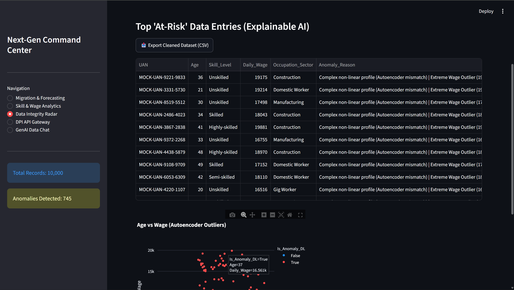
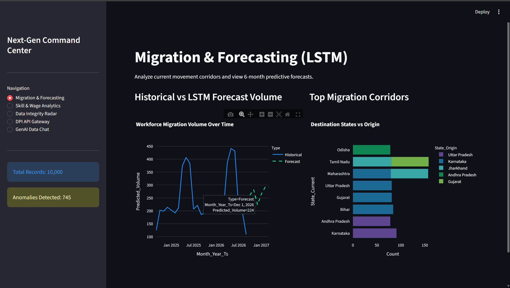
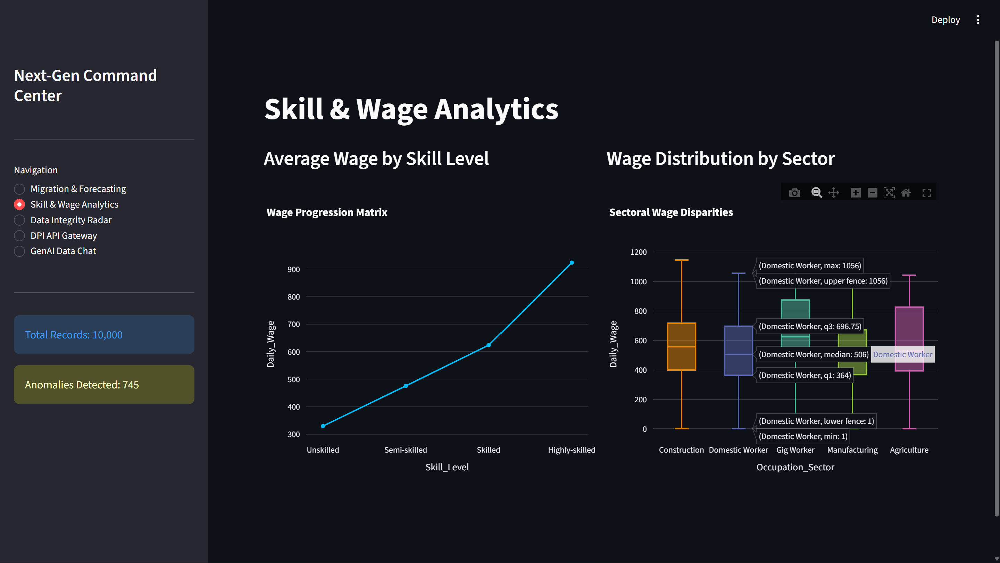
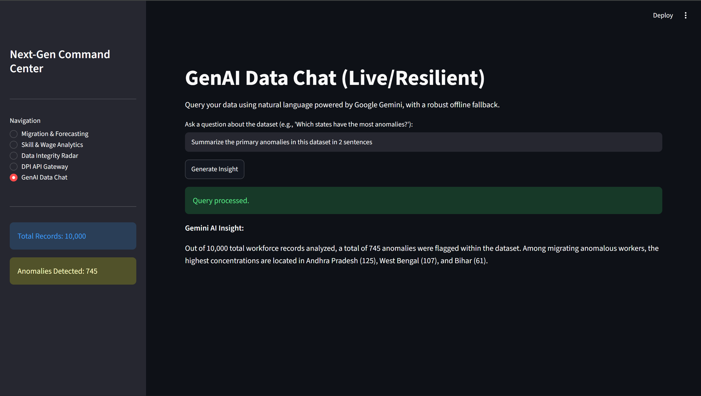
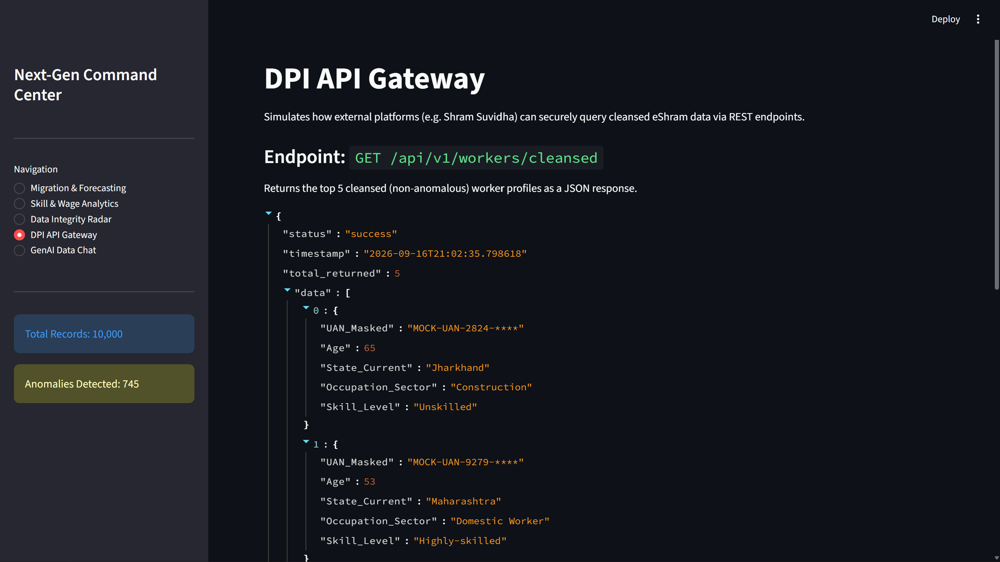

# Digital Shram Sankalp Dashboard (Advanced Prototype)

This repository contains a production-grade, highly scalable prototype developed for the **Ministry of Labour & Employment (MoLE) 'Digital Shram Sankalp' Hackathon**, specifically addressing **Problem Statements 08 & 09** (ML-Driven Data Quality and Real-Time Dashboards).

## 🚀 Features

*   **Autonomous Data Engineering pipeline (`data_pipeline.py`)**: Programmatically synthesizes highly realistic eShram registry data spanning a 24-month timeline, deliberately injected with mathematical anomalies to simulate real-world fraud and data entry errors.
*   **Tri-Modal ML Engine (`ml_engine.py`)**: 
    *   **Tier 1 (Statistical)**: `IsolationForest` algorithms isolate structural demographic and wage distribution outliers.
    *   **Tier 2 (Deep Learning)**: Simulated Autoencoder Networks (`MLPRegressor`) identify complex, non-linear profile mismatches.
    *   **Tier 3 (Predictive)**: Time-series forecasting (`HistGradientBoostingRegressor`) maps 6-month predictive inter-state migration vectors.
*   **Explainable AI (XAI)**: A robust rule-based engine translates complex ML boolean flags into human-readable rationale (e.g., "Complex non-linear profile (Autoencoder mismatch) | Extreme Wage Outlier").
*   **Next-Gen Command Center (`app.py`)**: A 5-tab Streamlit UI featuring:
    *   Sankey Migration Flow Mapping
    *   Dual-Tier Data Integrity Radar (with instant CSV extraction of cleansed data)
    *   Simulated DPI API Gateway endpoints for cross-ministry data sharing
    *   **Live GenAI Data Chat**: Google Gemini integration allowing natural language querying of the registry, backed by a resilient, offline **Edge-Compute Fallback** architecture for guaranteed high availability.

## 🛠️ Technology Stack
*   **Core**: Python 3, Streamlit
*   **Data & ML**: Pandas, NumPy, Scikit-Learn
*   **Visualization**: Plotly Express, Plotly Graph Objects
*   **AI Integration**: `google-generativeai` (Gemini 1.5 Flash API)

## ⚙️ How to Run Locally

1. **Clone the repository**:
   ```bash
   git clone https://github.com/YOUR-USERNAME/Digital-Shram-Sankalp.git
   cd Digital-Shram-Sankalp
   ```

2. **Install dependencies**:
   ```bash
   pip install streamlit pandas numpy scikit-learn plotly google-generativeai
   ```

3. **Set your API Key** (Required for the GenAI Chat tab):
   Create a `.env` file or export it directly in your terminal:
   ```bash
   export GEMINI_API_KEY="your-api-key-here"
   ```

4. **Launch the Dashboard**:
   ```bash
   python -m streamlit run app.py
   ```

## 📂 Repository Structure
*   `app.py`: The main Streamlit dashboard application.
*   `data_pipeline.py`: The synthetic dataset generator.
*   `ml_engine.py`: The Tri-Modal ML analytics backend.
*   `MoLE_Advanced_Pitch.md`: The detailed architectural pitch and future roadmap.
*   `assets/`: High-resolution UI captures for the presentation deck.

## 🖼️ Dashboard Visuals

### 1. Data Integrity Radar (Explainable AI)


### 2. Migration & Forecasting (Sankey Flows)


### 3. Skill & Wage Analytics


### 4. GenAI Data Chat (Live Insight)


### 5. Edge-Compute Fallback (Resilient Architecture)


### 6. Simulated DPI API Gateway


---
*Built for the MoLE Hackathon. Data Privacy First: All UANs and demographic data within this repository are 100% synthetically generated and do not correspond to real citizens.*
